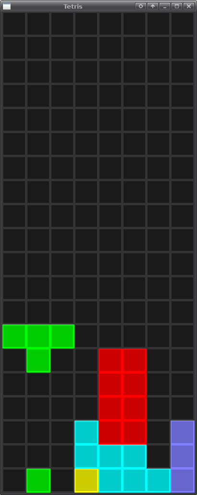

# Tetris Example in Rust

A Tetris example written in Rust using Piston.

* For demoing basic Rust coding
* 498 lines of code
* The completed lines are flashing
* No scoring
* No 'next piece view'
* No automatic restart after 'game over'
* No change in falling piece speed

