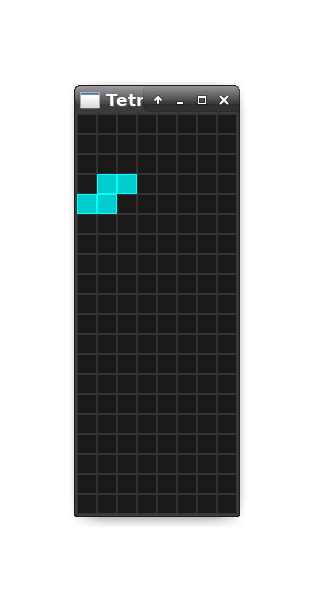

# Tetris Example in Rust, v2

A Tetris example written in Rust using Piston.

* For demoing basic Rust coding
* 414 lines of code
* A clear Git history that iterates on added features. See: `git log --reverse -p 855e7fddd..HEAD`
* The completed lines are flashing
* No scoring
* No 'next piece view'
* No automatic restart after 'game over'
* No change in falling piece speed

1) Install Rust from [main site](https://www.rust-lang.org).
2) Perform the following:

```
git clone https://github.com/da-x/tetris-demo
cd tetris-demo
cargo run
```

## Changes from v1

- Simplified the handling of the game state.
- Using a HashMap instead of a Vec<Vec<_>> for board and pieces.
- Less lines, same functionality.
- A clear Git history that iterates on added features.
